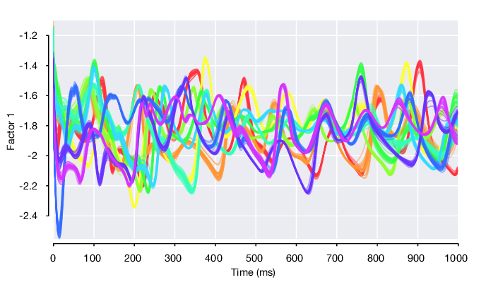
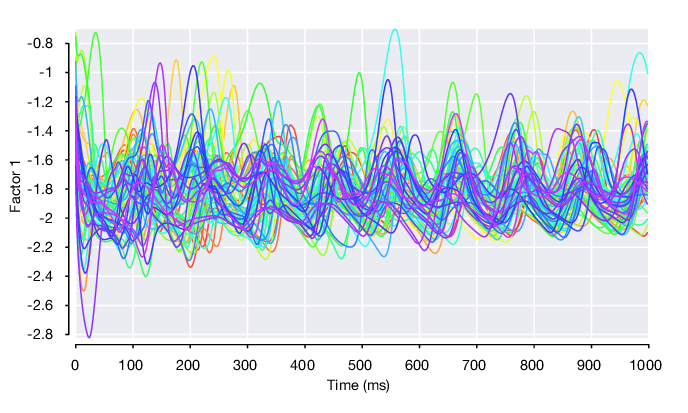
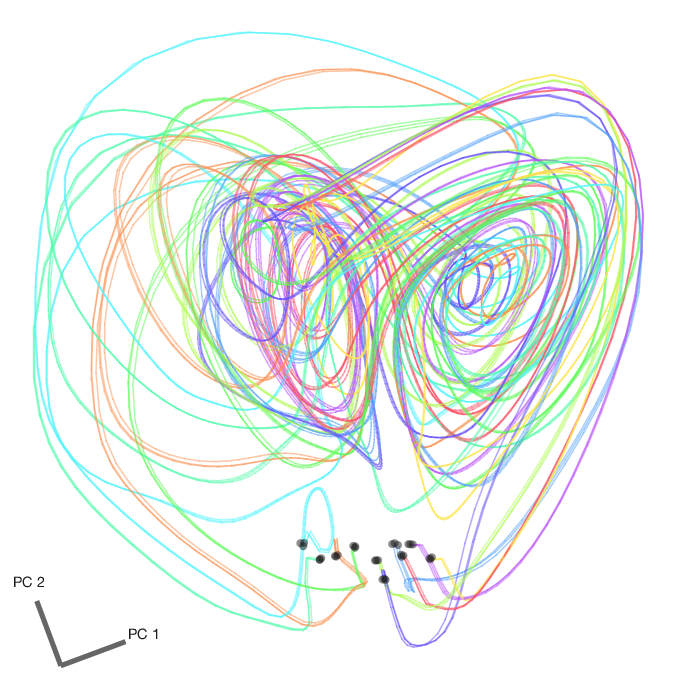

# Loading and Analyzing LFADS Results

  This documentation applies to LFADS models that have finished training, allowing you to load the results back into Matlab for further analysis.

## Reusing the `drive_script`

The `LFADS.Run` instances you created earlier with the `drive_script` uniquely specify the location of all LFADS related files on disk. In addition to enabling you to generate the inputs and scripts required to train LFADS, these objects also make it straightforward to load the results of LFADS back into Matlab for subsequent analysis. These results include the estimates of the posterior mean of the LFADS generator units, factors, and rates for each trial, as well as the learned model parameters.

Using your `RunCollection` `rc`, you can access individual runs by indexing directly into `rc.runs` which has size `rc.nRunSpecs` x `rc.nParams`. You can also search for a specific run using `rc.findRun`

```matlab
run1 = rc.findRuns('single_dataset001', 'param_pqQbzB');
```

The first argument searches over the `RunSpec`s by name, the second searches over the `RunParams` by hash value.

## Loading the posterior means

Using the `Run` instance, you can verify that its posterior means have been written to disk (indicating that the model has finished training successfully):

```matlab
>> run1.checkPosteriorMeansExist()

  logical

   1
```

And then load the posterior means using:
```matlab
pm = run1.loadPosteriorMeans();
```

Or alternatively, load all of your runs' posterior means by calling `rc.loadPosteriorMeans()`. Then you can access the cached posterior means in each run's `.posteriorMeans` property.

`pm` will be an instance of `LFADS.PosteriorMeans`:

```matlab
>> pm = rc.runs(1).posteriorMeans

pm =

  PosteriorMeans with properties:

                  time: [500x1 double]
    controller_outputs: []
               factors: [8x500x1560 double]
         generator_ics: [64x1560 double]
      generator_states: [64x500x1560 double]
                 rates: [29x500x1560 double]
             validInds: [312x1 uint16]
             trainInds: [1248x1 double]
                params: [1x1 MyExperiment.RunParams]
               isValid: 1
    nControllerOutputs: 0
       nGeneratorUnits: 64
              nFactors: 8
              nNeurons: 29
                     T: 500
               nTrials: 1560
```

Whose key properties are:

**`time`**:
: `nTime` x `1` time vector associated with each of the output fields, which you provided in your `generateRatesForDataset()` implementation

**`controller_outputs`**:
: `nControllerOutputs` x `nTime`. Inferred inputs to the generator network. Or empty, if no controller is used (`:::matlab c_co_dim == 0`)

**`factors`**:
:`nFactors` x `nTime` x `nTrials`. Factor outputs from the generator network.

**`generator_ics`**:
: `nGeneratorUnits` x `nTrials`. Initial conditions for the generator units.

**`generator_states`**:
: `nGeneratorUnits` x `nTime` x `nTrials`. Trajectories of the generator units.

**`rates`**:
: `nNeurons` x `nTime` x `nTrials`. Inferred firing rates of the neurons

**`validInds`**:
: List of trial indices used in the validation set

**`trainInds`**:
: List of trial indices used in the training set

If the run stitches together multiple datasets, then the `posteriorMeans` will be an `nDatasets` x 1 vector of `LFADS.PosteriorMeans` instances, each corresponding to an included dataset.

## Visualizing the factors

Single trial plot of factor 1 on first 10 conditions (color-coded), i.e. `:::matlab pm.factors(1, :, pm.conditionId <= 10)`.



Condition-average plot of factor 1 on all conditions, flanked by standard error of the mean.



## Comparing factor trajectories across datasets

### Single-dataset models

Looking at the 3 single-dataset model runs, we can plot single trials from the first 10 conditions for each of the 3 datasets. Note that the initial condition and subsequent 3 dimensional Lorenz atractor trajectory that defines each of the conditions is fixed and constant across datasets. However, we find that the factor 1 trajectories differ across the 3 datasets. As these factor trajectories are independently generated by 3 separate LFADS models

```matlab
pmSingleRuns = [rc.runs(1).loadPosteriorMeans(); ...
                rc.runs(2).loadPosteriorMeans(); ...
                rc.runs(3).loadPosteriorMeans()];
```


### Stitched multi-session model

However, if we load the posterior means for the stitched multi-session model (named `all`). we find that these same factor trajectories are now highly similar across datasets.


We can then take all 8 factors, average within conditions, and perform dimensionality reduction using PCA to visualize the factor trajectories in the top 2 principal components. Here are the factor trajectories from all 65 conditions from the first dataset. The initial conditions are marked with a black dot.


We can also plot the condition-averaged factor trajectories from all 3 datasets in the same PC space. Here are 10 conditions (color coded by condition). Note the similarity of each of the sets of 3 traces of the same color, which indicates that LFADS has successfully stitched these datasets together using the


