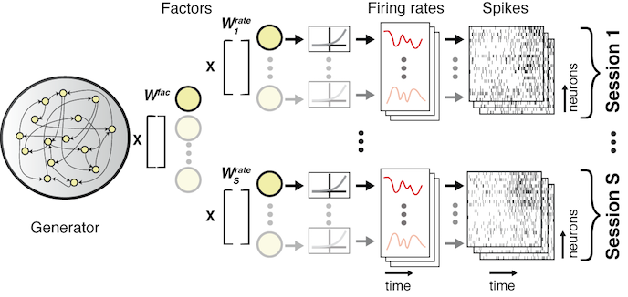
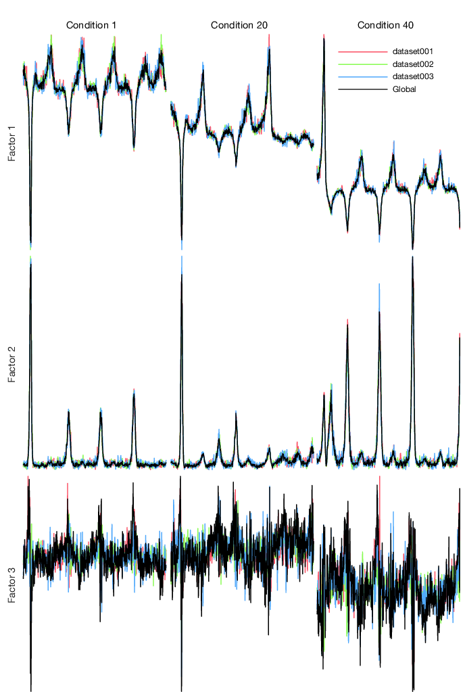

# Multi-dataset Stitching Models

If you specify multiple datasets to be included in an LFADS run by selecting multiple datasets in a `RunSpec`, the resulting model will stitch together the multiple datasets. The concept is to generate the spiking data in all of the included datasets using the same encoder and generator RNNs, but to interface to the separate neural datasets through _read-in_ and _readout_ alignment matrices.

Below is a schematic of the readout side. Here, the generator RNN and readout from generator units to factors is the same for all datasets. Therefore, one intends that the factor trajectories would be similar for similar trials / conditions across the datasets. Going from factors to rates, however, the recorded neurons are, in general, not the same across datasets, and the cardinality may differ. Thus, dataset-specific readout matrices are used to combine the factors to produce each of the recorded neurons' rates on each dataset.



A similar set of dataset specific read-in matrices are used to connect the spiking data to the encoder RNN in order to produce initial conditions and inferred inputs for each trial.

## Generating alignment matrices

These read-in and readout alignment matrices are learned from the data along with the other parameters. However, it's useful to seed the alignment matrices with an initial guess that suggests the correspondence between the datasets. If you have multiple datasets in a `RunSpec`, and the hyperparameter `useAlignmentMatrix` is set to `true` in the `RunParams`, then `lfads-run-manager` will automatically generate read-in alignment matrices from your data using a principal components regression algorithm that proceeds as:

* Generate condition-averaged firing rates for each neuron for each condition for each dataset
* Concatenate all of neurons from all datasets together to build a matrix which is (`nTime * nConditions`) `nNeuronsTotal`
* Perform PCA on this matrix and keep the projections of the data into the top `nFactors` components. These represent the global shared structure of the data across all datasets.
* For each dataset individually, regress these projection scores onto the condition-averaged rates from that dataset alone. The regression coefficients thus transform from that dataset's neurons to the global shared structure, and consequently, we take this matrix of regression coefficients as the readout matrix.

These matrices will be computed for you automatically by `run.prepareForLFADS()` and exported in the LFADS input folder. LFADS will generate an initial guess for the readout alignment matrix, which transforms from common factors back to dataset-specific rates, using the pseudo-inverse of the read-in alignment matrix computed by `lfads-run-manager`.

!!! tip "Alignment biases"
    In addition to this alignment read-in matrix, there is also an alignment bias vector which will be added to each neuron's counts before projecting through the matrix. Consequently, `lfads-run-manager` seeds this bias with the negative mean of the rates of each neuron.

## Setting up a multi-session LFADS run

Assuming you have finished reading through the [single-dataset LFADS walkthrough](single-session.md), you should be all set to generate some LFADS runs and start training. We'll be setting up another _drive script_ that will do the work of creating the appropriate instances, pointing at the datasets, creating the runs, and telling `LFADS Run Manager` to generate the files needed for LFADS. Below, we'll refer to the package name as `LorenzExperiment`, but you should substitute this with your package name.

!!! tip "Follow along with `LorenzExperiment.drive_script`"
    A complete drive script is available as a starting point in `+LorenzExperiment/drive_script.m` for you to copy/paste from.

For this demo, as before, we'll generate a few datasets of synthetic spiking data generated by a Lorenz attractor using the following code:

```matlab
datasetPath = '~/lorenz_example/datasets';
LFADS.Utils.generateDemoDatasets(datasetPath, 'nDatasets', 3);
```

This will simulate a chaotic 3 dimensional [Lorenz attractor](https://en.wikipedia.org/wiki/Lorenz_system) as the underlying dynamical system, initialized from 65 initial conditions. The key in these demonstration datasets is that the 65 conditions start from the same initial state and evolve identically across all 3 datasets. Each dataset, however, contains a disjoint set of neurons that are each a different linear recombination of the 3 dimensions of the Lorenz attractor state. This is analogous to the assumption we make in LFADS stitching--each dataset contains different sets of neurons, which are reconstructed from a shared low-dimensional set of factors.

## Building a dataset collection and adding datasets

First, create a dataset collection that points to a folder on disk where datasets are stored:

```matlab
dataPath = '~/lorenz_example/datasets';
dc = LorenzExperiment.DatasetCollection(dataPath);
dc.name = 'lorenz_example';
```

Then, we can add the individual datasets within based on their individual paths. Note that when a new dataset instance is created, it is automatically added to the `DatasetCollection` and will replace any dataset that has the same name if present.

```matlab
LorenzExperiment.Dataset(dc, 'dataset001.mat');
LorenzExperiment.Dataset(dc, 'dataset002.mat');
LorenzExperiment.Dataset(dc, 'dataset003.mat');
```

You can verify that the datasets have been added to the collection:

```matlab
>> dc
LorenzExperiment.DatasetCollection "lorenz_example"
  3 datasets in ~/lorenz_example/datasets
  [ 1] LorenzExperiment.Dataset "dataset001"
  [ 2] LorenzExperiment.Dataset "dataset002"
  [ 3] LorenzExperiment.Dataset "dataset003"

            name: 'lorenz_example'
         comment: ''
            path: '~/lorenz_example/datasets'
        datasets: [3x1 LorenzExperiment.Dataset]
       nDatasets: 3
    datasetNames: {3x1 cell}

```

You can access individual datasets using `:::matlab dc.datasets(1)` or by name with `:::matlab dc.matchDatasetsByName('dataset001')`.

You can then load all of the metadata for the datasets using:
```matlab
dc.loadInfo();
```

How this metadata is determined for each dataset may be customized as described in [Interfacing with your Datasets](/interfacing/#editing-datasetm-required). You can view a summary of the metadata using:

```matlab
>> dc.getDatasetInfoTable          

                  subject                  date             saveTags    nTrials    nChannels
              ________________    ______________________    ________    _______    _________
dataset001    'lorenz_example'    [31-Jan-2018 00:00:00]      '1'        1820         35    
dataset002    'lorenz_example'    [31-Jan-2018 00:00:00]      '1'        1885         26    
dataset003    'lorenz_example'    [31-Jan-2018 00:00:00]      '1'        1365         35    


```

## Create a `RunCollection`

We'll now setup a `RunCollection` that will contain all of the LFADS runs we'll be training. Inside this folder will be stored all of the processed data and LFADS output, nicely organized within subfolders.

```matlab
runRoot = '~/lorenz_example/runs';
rc = LorenzExperiment.RunCollection(runRoot, 'exampleStitching', dc);

% replace with approximate date script authored as YYYYMMDD
% to ensure forwards compatibility
rc.version = 20180131;
```

## Specify the hyperparameters in `RunParams`

We'll next specify a single set of hyperparameters to begin with. Since this is a simple dataset, we'll reduce the size of the generator network to 64 and reduce the number of factors to 8. The key change we'll make is to set `useAlignmentMatrix` to `true` in order to seed the read-in matrices.

```matlab
par = LorenzExperiment.RunParams;
par.name = 'first_attempt_stitching'; % completely optional
par.useAlignmentMatrix = true; % use alignment matrices initial guess for multisession stitching

par.spikeBinMs = 2; % rebin the data at 2 ms
par.c_co_dim = 0; % no controller --> no inputs to generator
par.c_batch_size = 150; % must be < 1/5 of the min trial count
par.c_factors_dim = 8; % and manually set it for multisession stitched models
par.c_gen_dim = 64; % number of units in generator RNN
par.c_ic_enc_dim = 64; % number of units in encoder RNN
par.c_learning_rate_stop = 1e-3; % we can stop really early for the demo
```

We then add this `RunParams` to the `RunCollection`:

```matlab
rc.addParams(par);
```

You can access the parameter settings added to `rc` using `rc.params`, which will be an array of `RunParams` instances.

## Specify the `RunSpec` set

Recall that `RunSpec` instances specify which datasets are included in a specific run. For stitching, we'll want to include all three datasets into a single model.

```matlab
% include all datasets
runSpecName = 'all';
runSpec = LorenzExperiment.RunSpec(runSpecName, dc, 1:dc.nDatasets);
rc.addRunSpec(runSpec);
```

You can adjust the arguments to the constructor of `LorenzExperiment.RunSpec`, but in the example provided the inputs define:

* the unique name of the run. Here we use `getSingleRunName`, a convenience method of `Dataset` that generates a name like `single_datasetName`.
* the `DatasetCollection` from which datasets will be retrieved
* the indices or names of datasets (as a string or cell array of strings) to include

If you like you can also add RunSpecs to train individual models for each dataset as well to facilitate comparison.

```matlab
% add one run for each single dataset
for iR = 1:dc.nDatasets
    runSpecName = dc.datasets(iR).getSingleRunName(); % 'single_dataset###'
    runSpec = LorenzExperiment.RunSpec(runSpecName, dc, iR);
    rc.addRunSpec(runSpec);
end
```

## Check the `RunCollection` and the `Run`

The `RunCollection` will now display information about the parameter settings and run specifications that have been added. Here there is only one parameter setting by one run specification, so we're only performing 1 run total.

```matlab
>> rc

LorenzExperiment.RunCollection "exampleStitching" (1 runs total)
  Dataset Collection "lorenz_example" (3 datasets) in ~/lorenz_example/datasets
  Path: ~/lorenz_example/runs/exampleStitching

  1 parameter settings
  [1 param_Qr2PeG data_RE1kuL] LorenzExperiment.RunParams "first_attempt_stitching" useAlignmentMatrix=true c_factors_dim=8 c_ic_enc_dim=64 c_gen_dim=64 c_co_dim=0 c_batch_size=150 c_learning_rate_stop=0.001

  1 run specifications
  [ 1] LorenzExperiment.RunSpec "all" (3 datasets)

                          name: 'exampleStitching'
                       comment: ''
                      rootPath: '~/lorenz_example/runs'
                       version: 201801
             datasetCollection: [1x1 LorenzExperiment.DatasetCollection]
                          runs: [1x1 LorenzExperiment.Run]
                        params: [1x1 LorenzExperiment.RunParams]
                      runSpecs: [1x1 LorenzExperiment.RunSpec]
                       nParams: 1
                     nRunSpecs: 1
                    nRunsTotal: 1
                     nDatasets: 3
                  datasetNames: {3x1 cell}
                          path: '~/lorenz_example/runs/exampleStitching'
      pathsCommonDataForParams: {'~/lorenz_example/runs/exampleStitching/data_RE1kuL'}
                pathsForParams: {'~/lorenz_example/runs/exampleStitching/param_Qr2PeG'}
    fileShellScriptTensorboard: '~/lorenz_example/runs/exampleStitching/launch_tensorboard.sh'
               fileSummaryText: '~/lorenz_example/runs/exampleStitching/summary.txt'
       fileShellScriptRunQueue: '~/lorenz_example/runs/exampleStitching/run_lfadsqueue.py'

>> run = rc.findRuns('all', 1);

LorenzExperiment.Run "all" (3 datasets)

  Path: ~/lorenz_example/runs/exampleStitching/param_Qr2PeG/all
  Data: ~/lorenz_example/runs/exampleStitching/data_RE1kuL
  LorenzExperiment.RunParams "first_attempt_stitching" : useAlignmentMatrix=true c_factors_dim=8 c_ic_enc_dim=64 c_gen_dim=64 c_co_dim=0 c_batch_size=150 c_learning_rate_stop=0.001

  3 datasets in "lorenz_example"
    [ 1] LorenzExperiment.Dataset "dataset001"
    [ 2] LorenzExperiment.Dataset "dataset002"
    [ 3] LorenzExperiment.Dataset "dataset003"

...

```

## Verifying the alignment matrices

Next, we'll run the principal components regression that generates the alignment matrices using the algorithm described [above](#generating-alignment-matrices). Then we'll verify that these matrices are able to project the data from each dataset into similar looking low-dimensional trajectories.

To visualize how well these initial alignment matrices are working, we can compare the common global PCs from all datasets against the projection of each dataset through the read-in matrices. That is, we can plot the regression target (global PCs) against the best possible reconstruction from each dataset.

```matlab
run.doMultisessionAlignment();
```

Under the hood, the alignment matrix calculations are performed by an instance of `LFADS.MutlisessionAlignmentTool`. To plot the reconstruction quality, you can call `tool.plotAlignmentReconstruction(numberOrIndicesOfFactorsToPlot, numberOrIndicesOfConditionsToPlot)`, like so:

```matlab
tool = run.multisessionAlignmentTool;

nFactorsPlot = 3;
conditionsToPlot = [1 20 40];
tool.plotAlignmentReconstruction(nFactorsPlot, conditionsToPlot);
```



In this example, the single-dataset predictions look quite similar to the global target, especially in the first 2 principal components which capture most of the variance.

The actual alignment matrices can be accessed using:
```matlab
tool.alignmentMatrices % nDatasets x 1 cell array of read-in matrices
```

## Prepare for LFADS

Now that you've set up your run collection with all of your runs, you can run the following to generate the files needed for running LFADS.

```matlab
rc.prepareForLFADS();
```

This will generate files for all runs. If you decide to add new runs, by adding additional run specifications or parameters, you can simply call `prepareForLFADS` again. Existing files won't be overwritten unless you call `rc.prepareForLFADS(true)`.

After running `prepareForLFADS`, the run manager will create the following files on disk under `rc.path`:

```bash
~/lorenz_example/runs/exampleStitching
├── data_4MaTKO
│   ├── inputInfo_dataset001.mat
│   ├── inputInfo_dataset002.mat
│   ├── inputInfo_dataset003.mat
│   ├── lfads_dataset001.h5
│   ├── lfads_dataset002.h5
│   └── lfads_dataset003.h5
├── param_YOs74u
│   └── all
│       └── lfadsInput
│           ├── inputInfo_dataset001.mat -> ../../../data_4MaTKO/inputInfo_dataset001.mat
│           ├── inputInfo_dataset002.mat -> ../../../data_4MaTKO/inputInfo_dataset002.mat
│           ├── inputInfo_dataset003.mat -> ../../../data_4MaTKO/inputInfo_dataset003.mat
│           ├── lfads_dataset001.h5 -> ../../../data_4MaTKO/lfads_dataset001.h5
│           ├── lfads_dataset002.h5 -> ../../../data_4MaTKO/lfads_dataset002.h5
│           └── lfads_dataset003.h5 -> ../../../data_4MaTKO/lfads_dataset003.h5
└── summary.txt

```

The organization of these files on disk is discussed in more detail [here](files.md). Also, a `summary.txt` file will be generated which can be useful for identifying all of the runs and their locations on disk. You can also generate this text from within Matlab by calling `rc.generateSummaryText()`.

```matlab
LorenzExperiment.RunCollection "exampleStitching2" (1 runs total)
  Path: ~/lorenz_example/runs/exampleStitching2
  Dataset Collection "lorenz_example" (3 datasets) in ~/lorenz_example/datasets

  ------------------------

  1 Run Specifications:

    [runSpec 1] LorenzExperiment.RunSpec "all" (3 datasets)
      [ds 1] LorenzExperiment.Dataset "dataset001"
      [ds 2] LorenzExperiment.Dataset "dataset002"
      [ds 3] LorenzExperiment.Dataset "dataset003"

  ------------------------

  1 Parameter Settings:

    [1 param_Qr2PeG data_RE1kuL] LorenzExperiment.RunParams "first_attempt_stitching"
      useAlignmentMatrix=true c_factors_dim=8 c_ic_enc_dim=64 c_gen_dim=64 c_co_dim=0 c_batch_size=150 c_learning_rate_stop=0.001

      spikeBinMs: 2
      trainToTestRatio: 4
      useAlignmentMatrix: true
      useSingleDatasetAlignmentMatrix: false
      scaleIncreaseStepsWithDatasets: true
      c_cell_clip_value: 5
      c_factors_dim: 8
      c_ic_enc_dim: 64
      c_ci_enc_dim: 128
      c_gen_dim: 64
      c_keep_prob: 0.95
      c_learning_rate_decay_factor: 0.98
      c_device: /gpu:0
      c_co_dim: 0
      c_do_causal_controller: false
      c_do_feed_factors_to_controller: true
      c_feedback_factors_or_rates: factors
      c_controller_input_lag: 1
      c_do_train_readin: true
      c_l2_gen_scale: 500
      c_l2_con_scale: 500
      c_batch_size: 150
      c_kl_increase_steps: 900
      c_l2_increase_steps: 900
      c_ic_dim: 64
      c_con_dim: 128
      c_learning_rate_stop: 0.001
      c_temporal_spike_jitter_width: 0
      c_allow_gpu_growth: true
      c_kl_ic_weight: 1
      c_kl_co_weight: 1
      c_inject_ext_input_to_gen: false
      c_prior_ar_atau: 10
      c_do_train_prior_ar_atau: true
      c_prior_ar_nvar: 0.1
      c_do_train_prior_ar_nvar: true
      num_samples_posterior: 512
      posterior_mean_kind: posterior_sample_and_average

```

After running `prepareForLFADS`, you can then run the LFADS model or models in the same way as with single-session models, using the instructions [here](running.md).
