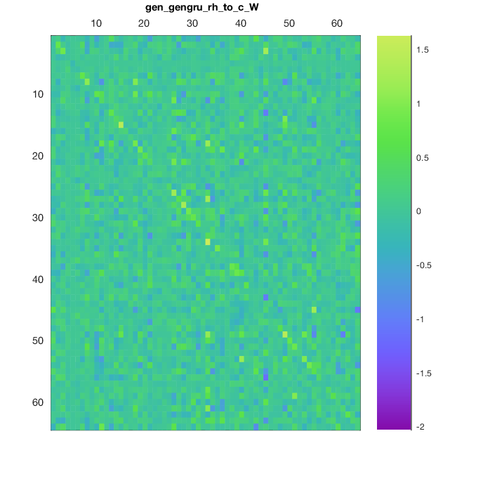
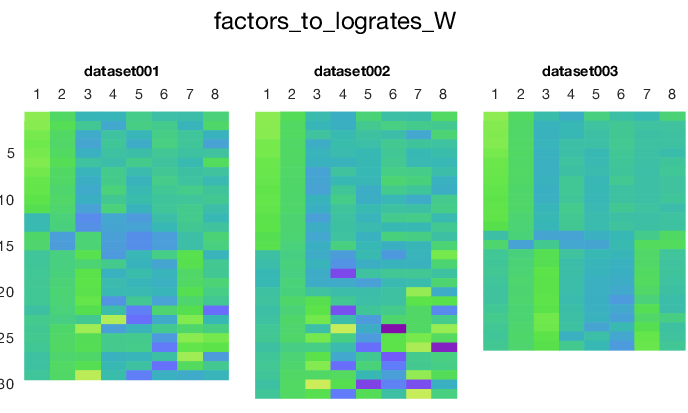

# Loading the trained LFADS model parameters

## Loading the `model_params`

After the LFADS run has finished, you will need to have LFADS write the model parameters to disk in a file called `lfadsOutput/model_params`, as described [here](running.md#writing-the-model-parameters). If you used the [run queue](running.md#lfads-queue-automatically-queueing-many-runs) to automatically launch all of your runs, you can skip this step as it was taken care of for you after training was completed.

`model_params` is an HD5 file that contains all of the model parameters. To load these, each `LFADS.Run` provides a method `run.loadModelTrainedParams()` that will return an instance of `LFADS.ModelTrainedParameters`. This instance will have many fields, corresponding to the set of parameters learned by LFADS.

## List of model trained parameters

Below is an annotated list of the properties found within the `ModelTrainedParameters` instance, along with the size of each parameter relative to hyperparameters specified in the corresponding `RunParams`.

For reference, here is the schematic of an LFADS model:


### Read-in from spikes to input factors

Name | Description | Size
-----|------|-------------
x_to_infac_W | readin alignment weights, mapping from counts to input factors | `nDatasets` x 1 cell of `nNeuronsThisDataset` x `c_factors_dim`
x_to_infac_b | readin alignment biases to input factors | `nDatasets` x 1 cell of 1 x `c_factors_dim`

### Initial condition encoder (forward)

Name | Description | Size
-----|------|-------------
ic_enc_fwd_t0 | forward IC encoder prior on t0 | 1 x `c_ic_enc_dim`
ic_enc_fwd_gru_xh_to_gates_ru_W | forward IC encoder GRU, mapping input+hiddens to gates r and u, weights | (`c_ic_enc_dim` + factors_dim) x (2 * `c_ic_enc_dim`)
ic_enc_fwd_gru_xh_to_gates_ru_b | forward IC encoder GRU bmapping input+hiddens to gates r and u, biases | 1 x (2*`c_ic_enc_dim`)
ic_enc_fwd_gru_xrh_to_c_W | forward IC encoder GRU mapping input, r, and hidden to candidates (weights) | (`c_ic_enc_dim` + `c_factors_dim`) x `c_ic_enc_dim`
ic_enc_fwd_gru_xrh_to_c_b | forward IC encoder GRU mapping input, r, and hidden to candidates (bias) | 1 x `c_ic_enc_dim`

### Initial condition encoder (reverse)

Name | Description | Size
-----|------|-------------
ic_enc_rev_t0 | reverse IC encoder prior on t0 | 1 x `c_ic_enc_dim`
ic_enc_rev_gru_xh_to_gates_ru_W | reverse IC encoder GRU, mapping input+hidden to gates r and u, weights | (`c_factors_dim` + `c_ic_enc_dim`) x (2*`c_ic_enc_dim`)
ic_enc_rev_gru_xh_to_gates_ru_b | reverse IC encoder GRU bmapping input+hidden to gates r and u, biases | 1 x (2*`c_ic_enc_dim`)
ic_enc_rev_gru_xrh_to_c_W | reverse IC encoder GRU mapping input+r+hidden to candidates (weights) | (`c_ic_enc_dim` + `c_factors_dim`) x `c_ic_enc_dim`
ic_enc_rev_gru_xrh_to_c_b | reverse IC encoder GRU mapping input+r+hidden to candidates (bias) | 1 x `c_ic_enc_dim`

### Initial condition g0

Name | Description | Size
-----|------|-------------
prior_g0_mean | Mean parameter in prior on initial condition g0 | 1 x `c_ic_dim`
prior_g0_logvar | Logvar parameter in prior on initial condition g0 | 1 x `c_ic_dim`
ic_enc_to_posterior_g0_mean_W | Weights for mean parameter in posterior of the initial condition g0 | (2*`c_ic_enc_dim`) x `c_ic_dim`
ic_enc_to_posterior_g0_mean_b  | Bias for mean parameter in posterior of the initial condition g0 | 1 x `c_ic_dim`
ic_enc_to_posterior_g0_logvar_W  | Weights for logvar parameter in posterior of the initial condition g0 | (2*`c_ic_enc_dim`) x `c_ic_dim`
ic_enc_to_posterior_g0_logvar_b  | Bias for logvar parameter in posterior of the initial condition g0 | 1 x `c_ic_dim`
g0_to_gen_ic_W | mapping from g0 to generator initial condition, weights | `c_ic_dim` x `c_gen_dim`
g0_to_gen_ic_b | mapping from g0 to generator initial condition, bias | 1 x `c_gen_dim`

### Controller encoder (forward)

Name | Description | Size
-----|------|-------------
ci_enc_fwd_t0 | forward controller prior on t0 | 1 x `c_ci_enc_dim`
ci_enc_fwd_gru_xh_to_ru_W | forward controller encoder GRU, mapping input+hidden to gates r and u, weights | (`ci_enc_dim` + `c_factors_dim`) x (2*`c_ci_enc_dim`)
ci_enc_fwd_gru_xh_to_ru_b | forward controller encoder GRU, mapping input+hidden to gates r and u, bias | 1 x (2*`c_ci_enc_dim`)
ci_enc_fwd_gru_xrh_to_c_W | forward controller encoder GRU mapping input, r, and hidden to candidates (weights) | (`c_ci_enc_dim` + `c_factors_dim`) x `c_ci_enc_dim`)
ci_enc_fwd_gru_xrh_to_c_b | forward controller encoder GRU mapping input, r, and hidden to candidates (bias) | 1 x `c_ci_enc_dim`

### Controller encoder (reverse)

Name | Description | Size
-----|------|-------------
ci_enc_rev_t0 | reverse controller prior on t0 | 1 x `c_ci_enc_dim`
ci_enc_rev_gru_xh_to_ru_W | reverse controller encoder GRU, mapping input+hidden to gates r and u, weights | (ci_enc_dim + factors_dim) x (2*`c_ci_enc_dim`)
ci_enc_rev_gru_xh_to_ru_b | reverse controller encoder GRU, mapping input+hidden to gates r and u, bias | 1 x (2*`c_ci_enc_dim`)
ci_enc_rev_gru_xrh_to_c_W | reverse controller encoder GRU mapping input, r, and hidden to candidates (weights) | (`c_ci_enc_dim` + `c_factors_dim`) x `c_ci_enc_dim`)
ci_enc_rev_gru_xrh_to_c_b | reverse controller encoder GRU mapping input, r, and hidden to candidates (bias) | 1 x `c_ci_enc_dim`

### Controlller RNN

Name | Description | Size
-----|------|-------------
con_gengru_x_to_ru_W | controller GenGRU, mapping input to gates r+u, weights | (`c_ci_enc_dim` * 2 + `c_factors_dim`) x (2*`c_con_dim`)
con_gengru_h_to_ru_W | controller GenGRU, mapping hidden to gates r+u, weights | `c_con_dim` x (2*`c_con_dim`)
con_gengru_h_to_ru_b | controller GenGRU, mapping hidden to gates r+u, weights | 1 x (2*`c_con_dim`)
con_gengru_x_to_c_W | controller GenGRU, mapping input to candidates, weights | (`c_ci_enc_dim` * 2 + `c_factors_dim`) x `c_con_dim`
con_gengru_rh_to_c_b | controller GenGRU, mapping r+hidden to candidates, bias | 1 x `c_con_dim`

### Controller output co

Name | Description | Size
-----|------|-------------
prior_ar1_logevars | autoregressive prior on controller outputs | 1 x `c_co_dim`
prior_ar1_logatau | autoregressive time constant prior on controller outputs | 1 x `c_co_dim`
con_co | prior on controller output | 1 x `c_con_dim`
con_to_posterior_co_mean_W | mapping from controller to mean parameter of co, weights | `c_con_dim` x `c_co_dim`
con_to_posterior_co_mean_b | mapping from controller to mean parameter of co, biases | 1 x `c_co_dim`
con_to_posterior_co_logvar_W | mapping from controller to logvar parameter of co, weights | `c_con_dim` x `c_co_dim`
con_to_posterior_co_logvar_b | mapping from controller to logvar parameter of co, biases | 1 x `c_co_dim`

### Generator RNN

Name | Description | Size
-----|------|-------------
gen_gengru_x_to_ru_W | generator GRU, mapping from input to gates r+u, weights | `c_co_dim` x (2*`c_gen_dim`)
gen_gengru_h_to_ru_W | generator GRU, mapping from input to gates r+u, weights | `c_gen_dim` x (2*`c_gen_dim`)
gen_gengru_h_to_ru_b | generator GRU, mapping from input to gates r+u, biases | 1 x (2*`c_gen_dim`)
gen_gengru_x_to_c_W | generator GRU, mapping from input to candidates, weights | `c_co_dim` x `c_gen_dim`
gen_gengru_rh_to_c_W | generator GRU, mapping from r+hidden to candidates, weights | `c_gen_dim` x `c_gen_dim`
gen_gengru_rh_to_c_b | generator GRU, mapping from r+hidden to candidates, biases | 1 x `c_gen_dim`

### Generator output

Name | Description | Size
-----|------|-------------
gen_to_factors_W | mapping from generator to factors, weights | `c_gen_dim` x `c_factors_dim`
factors_to_logrates_W | readout alignment weights | `nDatasets` x 1 cell of `c_factors_dim` x `nNeuronsThisDataset`
factors_to_logrates_b | readout alignment biases | `nDatasets` x 1 cell of 1 x `nNeuronsThisDataset`


## Loading `model_params` for Lorenz example

We can load the model trained parameters for our multi-dataset stitching run as follows. Note that all of the entries associated with the controller and inferred inputs to the generator are missing, as we trained without inferred inputs with `c_co_dim == 0`.

```matlab
>> mtp = rc.findRuns('all', 1).loadModelTrainedParams()

ans =

  ModelTrainedParams with properties:

   Read-in from spikes to input factors
                       x_to_infac_W: {3x1 cell}
                       x_to_infac_b: {3x1 cell}

   Initial condition encoder (forward)
                      ic_enc_fwd_t0: [64x1 single]
    ic_enc_fwd_gru_xh_to_gates_ru_W: [128x72 single]
    ic_enc_fwd_gru_xh_to_gates_ru_b: [128x1 single]
          ic_enc_fwd_gru_xrh_to_c_W: [64x72 single]
          ic_enc_fwd_gru_xrh_to_c_b: [64x1 single]

   Initial condition encoder (reverse)
                      ic_enc_rev_t0: [64x1 single]
    ic_enc_rev_gru_xh_to_gates_ru_W: [128x72 single]
    ic_enc_rev_gru_xh_to_gates_ru_b: [128x1 single]
          ic_enc_rev_gru_xrh_to_c_W: [64x72 single]
          ic_enc_rev_gru_xrh_to_c_b: [64x1 single]

   Initial condition g0
                      prior_g0_mean: [64x1 single]
                    prior_g0_logvar: [64x1 single]
      ic_enc_to_posterior_g0_mean_W: [64x128 single]
      ic_enc_to_posterior_g0_mean_b: [64x1 single]
    ic_enc_to_posterior_g0_logvar_W: [64x128 single]
    ic_enc_to_posterior_g0_logvar_b: [64x1 single]
                     g0_to_gen_ic_W: []
                     g0_to_gen_ic_b: []

   Controller encoder (forward)
                      ci_enc_fwd_t0: []
          ci_enc_fwd_gru_xh_to_ru_W: []
          ci_enc_fwd_gru_xh_to_ru_b: []
          ci_enc_fwd_gru_xrh_to_c_W: []
          ci_enc_fwd_gru_xrh_to_c_b: []

   Controller encoder (reverse)
                      ci_enc_rev_t0: []
          ci_enc_rev_gru_xh_to_ru_W: []
          ci_enc_rev_gru_xh_to_ru_b: []
          ci_enc_rev_gru_xrh_to_c_W: []
          ci_enc_rev_gru_xrh_to_c_b: []

   Controlller RNN
               con_gengru_x_to_ru_W: []
               con_gengru_h_to_ru_W: []
               con_gengru_h_to_ru_b: []
                con_gengru_x_to_c_W: []
               con_gengru_rh_to_c_W: []
               con_gengru_rh_to_c_b: []

   Controller output co
                 prior_ar1_logevars: []
                  prior_ar1_logatau: []
                             con_co: []
         con_to_posterior_co_mean_W: []
         con_to_posterior_co_mean_b: []
       con_to_posterior_co_logvar_W: []
       con_to_posterior_co_logvar_b: []

   Generator RNN
               gen_gengru_x_to_ru_W: []
               gen_gengru_h_to_ru_W: [128x64 single]
               gen_gengru_h_to_ru_b: [128x1 single]
                gen_gengru_x_to_c_W: []
               gen_gengru_rh_to_c_W: [64x64 single]
               gen_gengru_rh_to_c_b: [64x1 single]

   Generator output
                   gen_to_factors_W: [8x64 single]
              factors_to_logrates_W: {3x1 cell}
              factors_to_logrates_b: {3x1 cell}
```

The recurrent connectivity weight matrix of the `c_gen_dim==64` GRU generator RNN is given by `mtp.gen_gengru_rh_to_c_W`:



And the per-dataset readout matrices mapping factors to neurons' log(rates) are given by `mtp.factors_to_logrates_W`:


